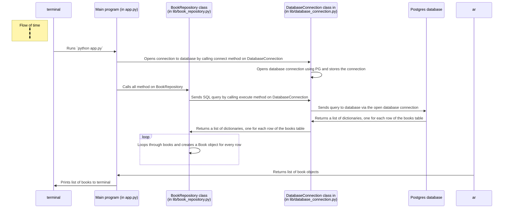

```mermaid
sequenceDiagram
    participant t as terminal
    participant app as Main program (in app.py)
    participant br as BookRepository class <br /> (in lib/book_repository.py)
    participant db_conn as DatabaseConnection class in <br /> (in lib/database_connection.py)
    participant db as Postgres database

    Note left of t: Flow of time <br />⬇ <br /> ⬇ <br /> ⬇ 

    t->>app: Runs `python app.py`
    app->>db_conn: Opens connection to database by calling connect method on DatabaseConnection
    db_conn->>db_conn: Opens database connection using PG and stores the connection
    app->>br: Calls all method on BookRepository
    br->>db_conn: Sends SQL query by calling execute method on DatabaseConnection
    db_conn->>db: Sends query to database via the open database connection
    db->>db_conn: Returns a list of dictionaries, one for each row of the books table
    db_conn->>br: Returns a list of dictionaries, one for each row of the books table
    loop 
        br->>br: Loops through books and creates a Book object for every row
    end
    ar->>app: Returns list of book objects
    app->>t: Prints list of books to terminal
```