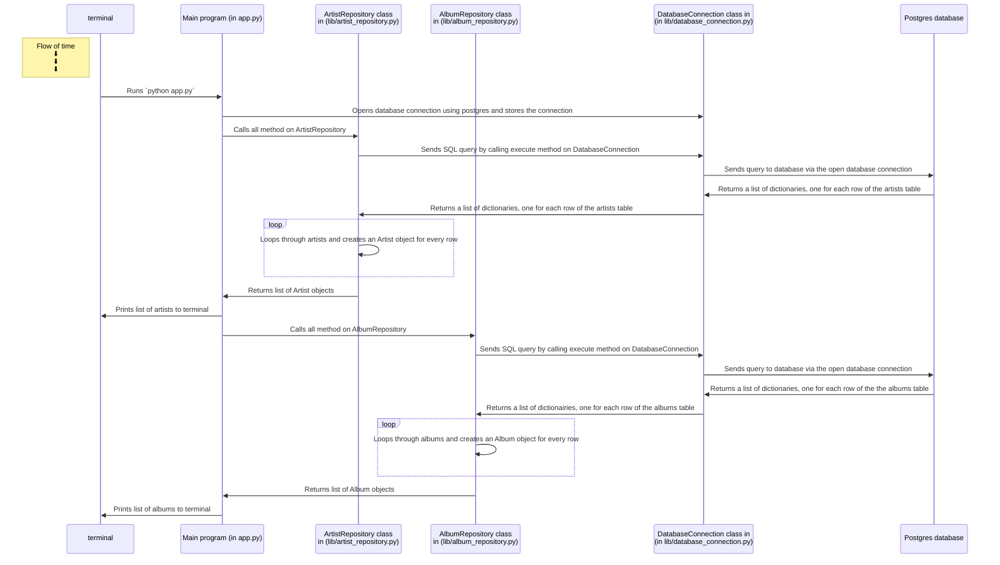

```mermaid
sequenceDiagram
    participant t as terminal
    participant app as Main program (in app.py)
    participant ar as ArtistRepository class <br /> in (lib/artist_repository.py)
    participant alr as AlbumRepository class <br /> in (lib/album_repository.py)
    participant db_conn as DatabaseConnection class in <br /> (in lib/database_connection.py)
    participant db as Postgres database

    Note left of t: Flow of time <br />⬇ <br /> ⬇ <br /> ⬇ 

    t->>app: Runs `python app.py`
    app->>db_conn: Opens database connection using postgres and stores the connection
    app->>ar: Calls all method on ArtistRepository
    ar->>db_conn: Sends SQL query by calling execute method on DatabaseConnection
    db_conn->>db: Sends query to database via the open database connection 
    db->>db_conn: Returns a list of dictionaries, one for each row of the artists table
    db_conn->>ar: Returns a list of dictionaries, one for each row of the artists table
    loop
        ar->>ar: Loops through artists and creates an Artist object for every row
    end
    ar->>app: Returns list of Artist objects
    app->>t: Prints list of artists to terminal
    app->>alr: Calls all method on AlbumRepository
    alr->>db_conn: Sends SQL query by calling execute method on DatabaseConnection
    db_conn->>db: Sends query to database via the open database connection
    db->>db_conn: Returns a list of dictionaries, one for each row of the the albums table
    db_conn->>alr: Returns a list of dictionairies, one for each row of the albums table
    loop
        alr->>alr: Loops through albums and creates an Album object for every row
    end
    alr->>app: Returns list of Album objects
    app->>t: Prints list of albums to terminal

```